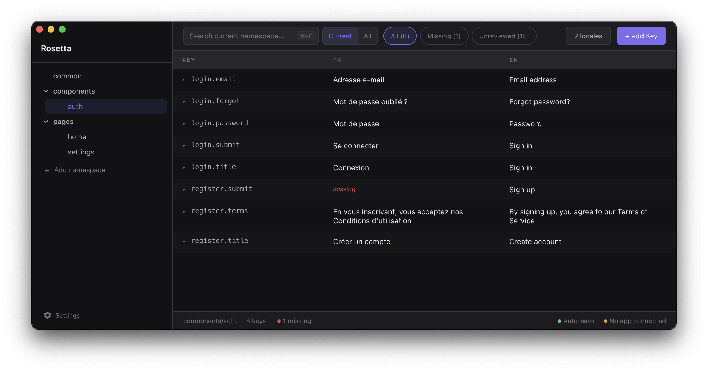
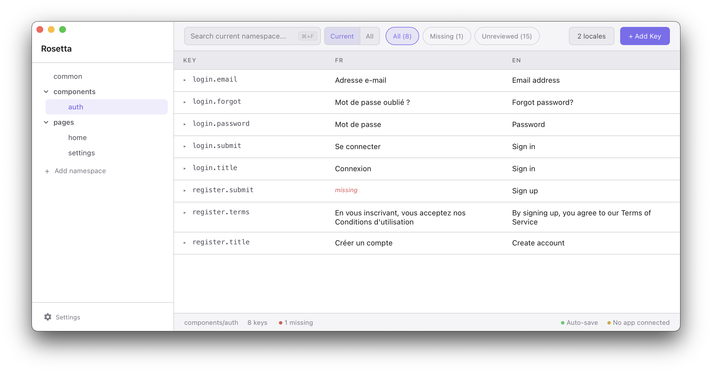

# Rosetta

A lightweight desktop editor for JSON i18n locale files. Open a folder, edit translations, see changes live in your app.

## What it does

- Spreadsheet-style table editor for translation keys across locales
- Namespace tree with folder grouping, search, and filters (missing, unreviewed)
- Live preview — edits push to your running app via WebSocket, no restart needed
- Review tracking to mark translations as checked
- CLI for CI: check missing keys, coverage stats, completeness
- macOS, Windows, Linux

| | |
|:---:|:---:|
|  |  |
|  ||

## Install

### Desktop app

Grab the latest build from [Releases](https://github.com/TerraQuanTech/Rosetta/releases). No setup required — just open the app and point it at your locales folder.

### VS Code extension

Install [Rosetta i18n](https://marketplace.visualstudio.com/items?itemName=TerraQuantTech.rosetta-i18n) from the VS Code Marketplace, or search "Rosetta i18n" in the extensions panel. Same editor, same features, right inside VS Code. See the [extension README](packages/vscode-extension/README.md) for details.

### CLI

Install the `rosetta` command from within the app (Settings) or run it directly:

```bash
rosetta ./locales missing    # Show missing translations
rosetta ./locales stats      # Coverage statistics
rosetta ./locales complete   # Check if all translations are complete (exit code for CI)
```

## Live preview

Install [`@terraquant/rosetta-connect`](packages/rosetta-connect) in your app to get real-time translation updates while editing:

```bash
npm install @terraquant/rosetta-connect
```

```ts
import i18next from "i18next";
import { connectRosetta } from "rosetta-connect";

if (process.env.NODE_ENV === "development") {
    connectRosetta(i18next);
}
```

See the [full setup guide](docs/GUIDE.md) for details.

## Locale directory structure

Rosetta expects the standard i18next file layout:

```
locales/
  en/
    common.json
    pages/
      home.json
  fr/
    common.json
    pages/
      home.json
```

Each top-level directory is a locale. JSON files and subdirectories become namespaces. Nested keys are flattened with dot notation in the editor.

## FAQ

<details>
<summary>Why does this exist? There are other i18n editors out there.</summary>

> Most of them are full-blown platforms — cloud-hosted, team-based, with pricing tiers and onboarding flows. Great if you need that, but overkill if you just want to edit some JSON files.
>
> Rosetta is a local desktop app that opens a folder and lets you work. It's meant to be trivially easy to set up and operate, even for non-technical people like translators who just need to fill in strings.

</details>

<details>
<summary>What does the workflow look like?</summary>

> For developers: open your project's locales folder in Rosetta and edit directly. Hook up the live preview connector and see changes in your running app as you type.
>
> For translators: get a copy of the locales folder from your dev team, download Rosetta, and start editing. If the dev provides a running build of the app with the connector enabled, translators can see their changes reflected live — no dev environment needed.

</details>

<details>
<summary>Is this the right tool for my team?</summary>

> If you're a large team with multiple translators working simultaneously and need collaboration features, access control, or translation memory — look at dedicated platforms like [Crowdin](https://crowdin.com/) or [Lokalise](https://lokalise.com/).
>
> If you're a small dev team that either does translations in-house or sends out one-off tasks to freelance translators, Rosetta is built for you.

</details>

## License

[MIT](LICENSE)
