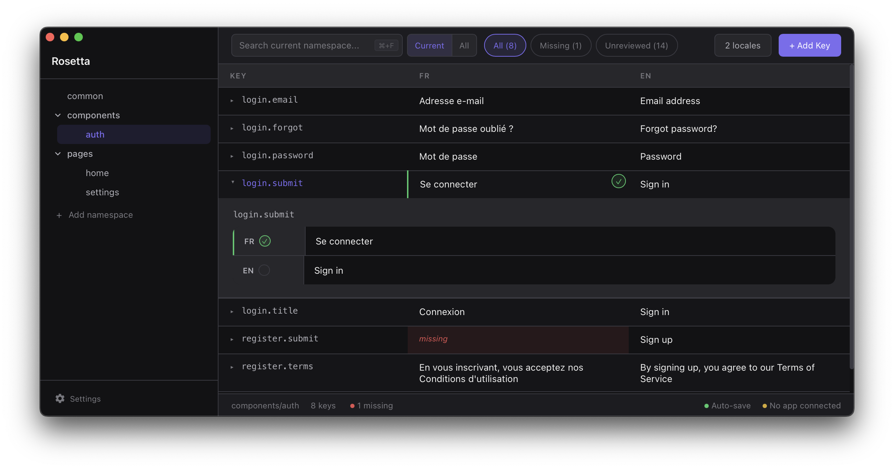

# rosetta-connect

Live-reload translations from [Rosetta](https://github.com/TerraQuanTech/Rosetta) into your running app. Edit a translation in Rosetta, see it in your app instantly — no restart needed.

<p align="center">
  
</p>

## Rosetta App

This package is the client-side connector for [Rosetta](https://github.com/TerraQuanTech/rosetta). It works with both the desktop app and the [VS Code extension](https://marketplace.visualstudio.com/items?itemName=TerraQuantTech.rosetta-i18n).

- **Desktop app** — download from the [releases page](https://github.com/TerraQuanTech/rosetta/releases)
- **VS Code extension** — install [Rosetta i18n](https://marketplace.visualstudio.com/items?itemName=TerraQuantTech.rosetta-i18n) from the Marketplace

## Install

```bash
npm install @terraquant/rosetta-connect
```

Peer dependency: `i18next >= 21`

## Usage

```ts
import i18next from "i18next";
import { connectRosetta } from "rosetta-connect";

if (process.env.NODE_ENV === "development") {
    const disconnect = connectRosetta(i18next);
}
```

Returns a cleanup function. In React:

```ts
useEffect(() => {
    if (process.env.NODE_ENV !== "development") return;
    return connectRosetta(i18next);
}, []);
```

## Options

```ts
connectRosetta(i18next, {
    port: 4871, // WebSocket port (default: 4871)
    reconnectInterval: 3000, // Retry delay in ms (default: 3000)
    verbose: true, // Log to console (default: true)
    appName: "My App", // Shown in Rosetta status bar
    updateStrategy: "bundle", // "bundle" (default) or "resource"
});
```

## How it works

Rosetta runs a WebSocket server (default port `4871`). This library connects and listens for:

- **`translation:update`** — single key changed. Applied via `addResourceBundle()` with deep merge, then triggers a React re-render via `languageChanged` event.
- **`translation:reload`** — namespace restructured (key added/deleted/renamed). Triggers `reloadResources()` to re-fetch from your backend.

Works in any environment with WebSocket support: browsers, Electron (main and renderer), Node.js 22+.

## Troubleshooting

<details>
<summary>App doesn't connect</summary>

> Check that Rosetta is running with the connector enabled (Settings > Live Preview Connector) and the port matches.

</details>

<details>
<summary>UI doesn't refresh</summary>

> Make sure you're using `react-i18next` with `useTranslation()` or `<Trans>`. Static `i18next.t()` calls outside React won't auto-update.

</details>

<details>
<summary><code>reloadResources</code> has no effect</summary>

> Your i18next backend needs to support reloading (e.g. `i18next-http-backend`). If translations are bundled at build time, only single-key updates will work live.

</details>

## FAQ

<details>
<summary>Why does this exist? There are other i18n editors out there.</summary>

> Most of them are full-blown platforms — cloud-hosted, team-based, with pricing tiers and onboarding flows. Great if you need that, but overkill if you just want to edit some JSON files.
>
> Rosetta is a local desktop app that opens a folder and lets you work. It's meant to be trivially easy to set up and operate, even for non-technical people like translators who just need to fill in strings.

</details>

<details>
<summary>What does the workflow look like?</summary>

> For developers: open your project's locales folder in Rosetta and edit directly. Hook up the live preview connector and see changes in your running app as you type.
>
> For translators: get a copy of the locales folder from your dev team, download Rosetta, and start editing. If the dev provides a running build of the app with the connector enabled, translators can see their changes reflected live — no dev environment needed.

</details>

<details>
<summary>Is this the right tool for my team?</summary>

> If you're a large team with multiple translators working simultaneously and need collaboration features, access control, or translation memory — look at dedicated platforms like [Crowdin](https://crowdin.com/) or [Lokalise](https://lokalise.com/).
>
> If you're a small dev team that either does translations in-house or sends out one-off tasks to freelance translators, Rosetta is built for you.

</details>
